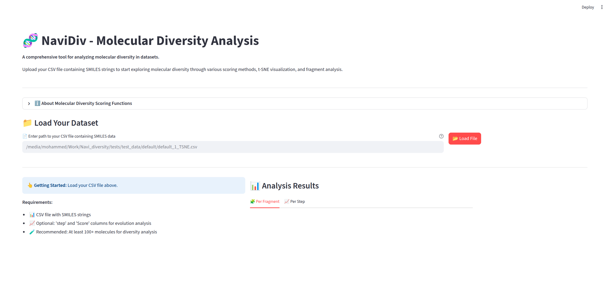
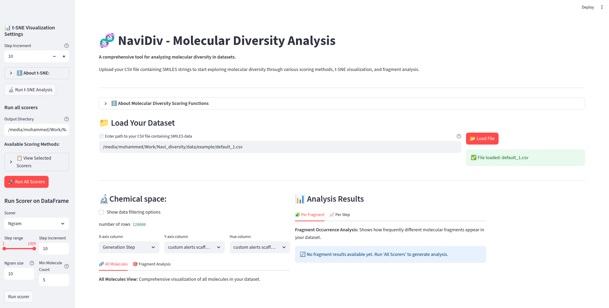
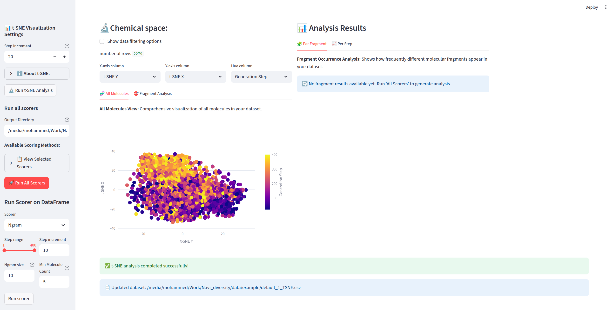
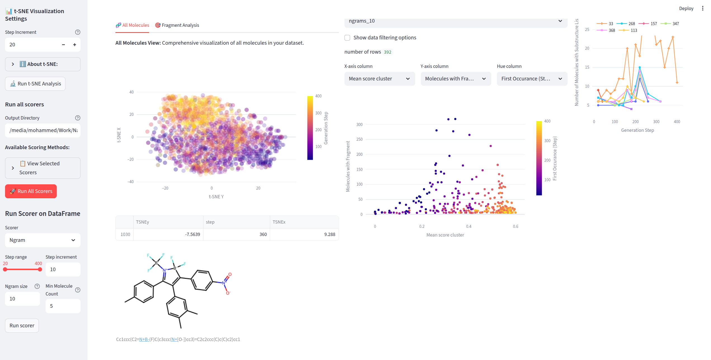
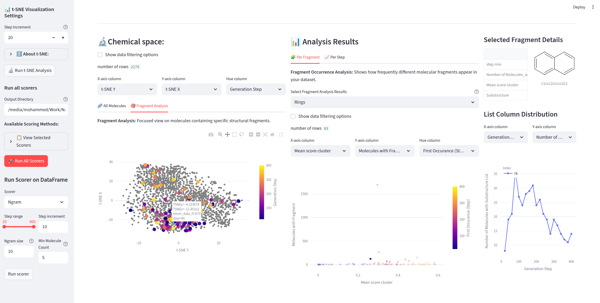

# NaviDiv App Tutorial

Welcome to the NaviDiv application tutorial! This guide will walk you through using the web interface for molecular diversity analysis.

## Getting Started

### Prerequisites
- Python environment with NaviDiv installed
- CSV file containing SMILES molecular data
- Optional: 'step' and 'Score' columns for evolution analysis

### Launching the App

1. Open your terminal and navigate to the NaviDiv directory
2. Activate your conda environment:
   ```bash
   conda activate NaviDiv
   ```
3. Launch the Streamlit app:
   ```bash
   streamlit run app.py
   ```
4. Your browser should automatically open to `http://localhost:8501`

## Step 1: Landing Page Overview



When you first open the app, you'll see:

- **Title**: NaviDiv - Molecular Diversity Analysis 🧬
- **Description**: Overview of the tool's capabilities
- **Information Section**: Expandable section about molecular diversity scoring functions
- **File Upload Section**: Where you'll load your dataset

### Understanding the Scoring Functions

Click on "ℹ️ About Molecular Diversity Scoring Functions" to learn about:

- **N-gram String Analysis**: SMILES-based pattern analysis
- **Scaffold Diversity Analysis**: Murcko framework decomposition
- **Molecular Clustering**: Similarity-based grouping
- **Reference Dataset Comparison**: Novel vs. known structure identification
- **Ring System Analysis**: Cyclic structure diversity
- **Functional Group Analysis**: Chemical functionality patterns
- **Fragment Analysis**: Basic and advanced molecular decomposition

## Step 2: Loading Your Dataset



### File Requirements

Your CSV file should contain:
- **SMILES column**: Molecular structures in SMILES format
- **Optional step column**: For temporal analysis
- **Optional Score column**: For optimization tracking

### Loading Process

1. **Enter File Path**: Type or paste the full path to your CSV file in the text input
   - Example: `/path/to/your/molecules.csv`
   - Use the placeholder path as a reference format

2. **Click Load File**: Press the "📂 Load File" button to validate and load your dataset

3. **Validation**: The app will check:
   - File exists at the specified path
   - File is in CSV format
   - Contains valid SMILES data

## Step 3: Running t-SNE Analysis

### Initial Analysis Setup

Once your dataset is loaded, the first step is usually to run t-SNE analysis to visualize your chemical space:

1. **Click "Run t-SNE"** button in the sidebar
2. **Wait for processing** - this may take a few moments depending on dataset size
3. **View results** in the main visualization area



### Understanding t-SNE Results

After running t-SNE, you'll see:
- **2D scatter plot** showing molecular distribution in chemical space
- **Color-coded points** representing different molecules
- **Interactive visualization** with zoom and pan capabilities
- **Two tabs for exploration**:
  - 🧬 **All Molecules Tab**: Complete dataset visualization
  - 🎯 **Fragment Analysis Tab**: Focused fragment-based views

### t-SNE Features
- **Purpose**: Creates 2D visualization of molecular diversity
- **Method**: Reduces high-dimensional molecular fingerprints to 2D coordinates
- **Benefits**: Reveals clustering patterns and chemical space organization
- **Output**: Adds t-SNE coordinates to your dataset for further analysis

## Step 4: Running Diversity Scorers

### Individual Scorer Analysis

You can run specific diversity scoring methods to focus on particular aspects:

#### Running N-gram Analysis



**N-gram String Analysis** examines SMILES-based patterns:
1. **Click "Run Scorer"** in the sidebar
2. **Select "Ngram"** from the dropdown
3. **Click "Run Selected Scorer"**
4. **View results** in the Analysis Results section

**What N-gram analysis shows**:
- Common substrings in SMILES representations
- Recurring sequence patterns
- String-based molecular motifs
- Frequency distribution of character patterns

#### Running Fragment Analysis



**Fragment Analysis** provides detailed molecular decomposition:
1. **Select "Fragments_default"** from the scorer dropdown
2. **Execute the analysis**
3. **Explore fragment occurrence patterns**
4. **Identify common structural motifs**

**Fragment analysis reveals**:
- Molecular building blocks
- Structural diversity patterns
- Common and rare fragments
- Fragment frequency distributions

### Comprehensive Analysis

#### Run All Scorers
- **Purpose**: Comprehensive diversity analysis using all available scoring methods
- **What it does**: 
  - Analyzes fragments, scaffolds, clusters, and other diversity metrics
  - Generates detailed reports per fragment and per step
- **Output**: Creates analysis files in a scorer_output directory
- **Time**: May take several minutes for large datasets

#### Available Scoring Methods
- **Scaffold**: Murcko framework decomposition
- **Cluster**: Similarity-based molecular grouping
- **Original**: Reference dataset comparison
- **RingScorer**: Ring system analysis
- **FGscorer**: Functional group analysis
- **Fragments_basic**: Basic fragment analysis
- **Fragments_elemental**: Elemental wireframe transformation

#### Run All Scorers
- **Purpose**: Comprehensive diversity analysis using all available scoring methods
- **What it does**: 
  - Analyzes fragments, scaffolds, clusters, and other diversity metrics
  - Generates detailed reports per fragment and per step
- **Output**: Creates analysis files in a scorer_output directory

#### Run Individual Scorer
- **Purpose**: Run specific diversity scoring methods
- **Options**: Choose from N-gram, Scaffold, Cluster, Ring, Functional Group, or Fragment analysis
- **Output**: Targeted analysis results

## Step 5: Viewing and Interpreting Results

### Analysis Results Section

After running analyses, results appear in two main tabs:

#### 📊 Per Fragment Tab

**What you'll see**:
- Fragment occurrence frequency charts
- Bar plots showing fragment diversity metrics
- Dropdown menu to select different analysis results
- Interactive visualizations with hover details

**How to interpret**:
- **High frequency fragments**: Common structural motifs in your dataset
- **Low frequency fragments**: Rare or unique structural elements
- **Distribution patterns**: Overall diversity characteristics
- **Comparative analysis**: Different scorer results side-by-side

#### 📈 Per Step Tab

**Temporal Evolution Analysis**:
- Shows how diversity metrics change over generation steps
- Line plots tracking diversity trends
- Useful for optimization and reinforcement learning workflows
- Reveals how molecular generation evolves over time

**Key metrics to watch**:
- **Diversity trends**: Increasing or decreasing over time
- **Convergence patterns**: Plateau regions indicating stability
- **Optimization phases**: Different stages of molecular generation

### Interactive Features

**Plot Interactions**:
- **Zoom and Pan**: Use mouse wheel and drag to explore
- **Hover Information**: Mouse over data points for detailed information
- **Selection Tools**: Click and drag to select specific regions
- **Download Options**: Save plots in various formats
- **Data Export**: Download underlying data for further analysis

**Navigation**:
- **Dropdown Selections**: Choose between different analysis results
- **Tab Switching**: Move between fragment and step-based views
- **Sidebar Controls**: Access analysis tools and settings

## Step 6: Advanced Analysis Workflows

### Complete Fragment Analysis Workflow

**Recommended sequence for comprehensive analysis**:

1. **Load your dataset** with molecular structures
2. **Run t-SNE** to create 2D chemical space visualization (see Step 3)
3. **Run individual scorers** to understand specific aspects:
   - Start with **N-gram analysis** for sequence patterns
   - Follow with **Fragment analysis** for structural decomposition
   - Add **Scaffold analysis** for core frameworks
4. **Run All Scorers** for comprehensive diversity analysis
5. **Compare results** across different scoring methods
6. **Export insights** for further research

### Fragment Highlighting and Selection

**Using the Fragment Analysis Tab**:
1. **Run fragment analysis** first to generate fragment data
2. **Switch to 🎯 Fragment Analysis tab** in the visualization
3. **Select specific fragments** from analysis results
4. **View highlighted molecules** containing those fragments
5. **Compare fragment distributions** across your dataset

### Temporal and Evolution Analysis

**For REINVENT or optimization datasets**:

**Prerequisites**:
- CSV with 'step' or 'stage' column indicating generation/optimization step
- 'Score' column for tracking optimization progress

**Analysis steps**:
1. **Load temporal dataset** with step information
2. **Run comprehensive analysis** (All Scorers recommended)
3. **Navigate to 📈 Per Step tab** in results section
4. **Track diversity evolution** over optimization steps
5. **Identify optimization phases**:
   - **Exploration phase**: High diversity, varied structures
   - **Exploitation phase**: Lower diversity, focused optimization
   - **Convergence phase**: Stable diversity around optimal regions

### Comparative Analysis

**Comparing different datasets or conditions**:
1. **Analyze first dataset** completely
2. **Export or screenshot key results**
3. **Load second dataset** and repeat analysis
4. **Compare diversity patterns** between conditions
5. **Document differences** in fragment distributions and trends

## Step 7: Tips for Best Results

### Data Preparation
- **Clean SMILES**: Ensure valid SMILES strings
- **Sufficient diversity**: Include at least 100+ molecules for meaningful analysis
- **Consistent format**: Use standard SMILES notation

### Performance Optimization
- **File size**: Large datasets (>10,000 molecules) may take longer to process
- **Memory usage**: Monitor system resources during analysis
- **Browser responsiveness**: Use modern browsers for best performance

## Step 8: Troubleshooting

#### Common Issues
1. **File not found**: Check file path and permissions
2. **Invalid SMILES**: Review molecular structures in your dataset
3. **Memory errors**: Try smaller datasets or increase system memory
4. **Slow performance**: Close other applications and browser tabs

#### Error Messages
- **"File not found"**: Verify the complete file path
- **"File should be a CSV"**: Ensure file extension is .csv
- **"No valid SMILES found"**: Check SMILES column formatting

## Step 9: Complete Example Workflow

### Visual Walkthrough

Here's a complete example workflow using all the available screenshots:

1. **Start with Landing Page** (screenshots/landing_page.png)
   - Launch the app using `streamlit run app.py`
   - Review the scoring function information
   - Prepare your CSV file path

2. **Load Your Dataset** (screenshots/after_loading_dataset.png)
   - Enter the file path to your molecular CSV
   - Click "Load File" and verify successful loading
   - Confirm your data appears in the interface

3. **Run t-SNE Analysis** (screenshots/after_TSNE.png)
   - Click "Run t-SNE" in the sidebar
   - Wait for processing completion
   - Explore the 2D chemical space visualization
   - Switch between All Molecules and Fragment Analysis tabs

4. **Perform Individual Analysis** 
   - **N-gram Analysis** (screenshots/after_running_ngram_scorer.png):
     - Select "Ngram" from the scorer dropdown
     - Execute analysis and review string pattern results
   - **Fragment Analysis** (screenshots/after_running_fragment_scorer.png):
     - Select "Fragments_default" from the dropdown
     - Run analysis and explore structural decomposition results

5. **Comprehensive Analysis**
   - Run "All Scorers" for complete diversity assessment
   - Review results in both Per Fragment and Per Step tabs
   - Compare different scoring method outputs

6. **Interpret and Export**
   - Analyze fragment frequency distributions
   - Export plots and data for research documentation
   - Save insights for integration with other workflows

## Step 10: Next Steps

After completing your analysis:

- **Export results** for further processing
- **Compare different datasets** by loading new files
- **Integrate with REINVENT4** for generative workflows
- **Use programmatic API** for automated analysis

## Step 11: Support and Additional Resources

For additional help:
- Check the main README for API documentation
- Review example datasets in the test_data directory
- Report issues on the GitHub repository
- Consult the scientific publication for methodology details

Happy analyzing! 🧬📊
